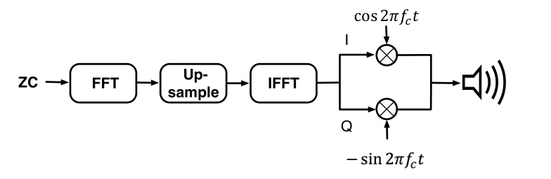
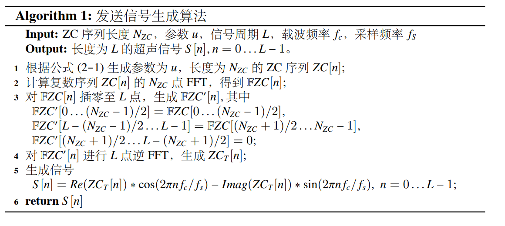
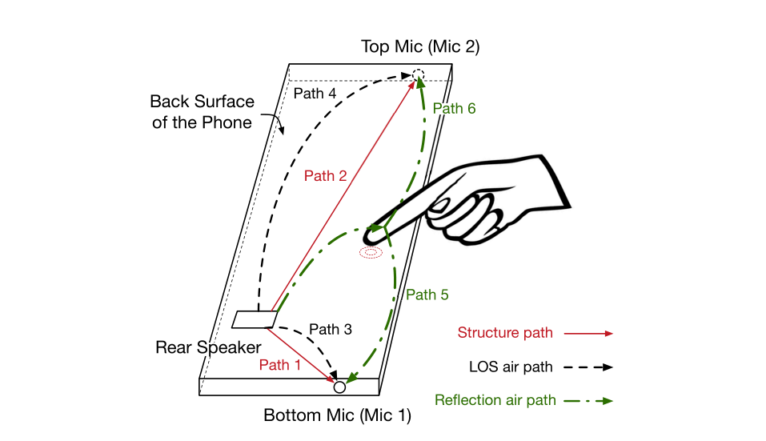
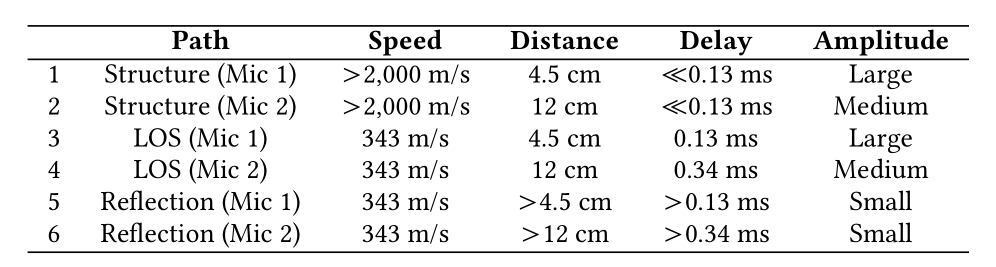
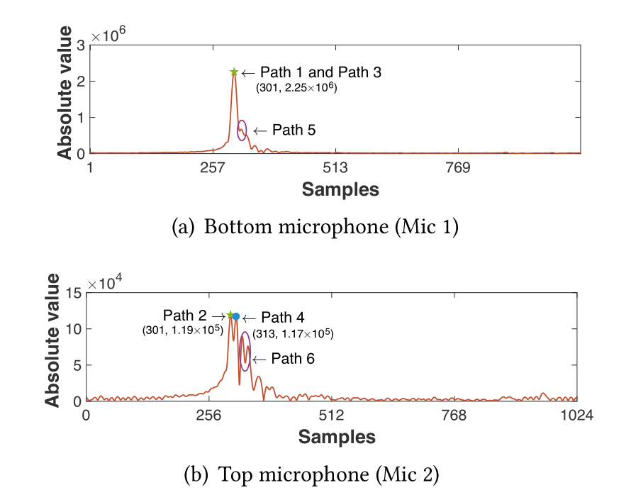
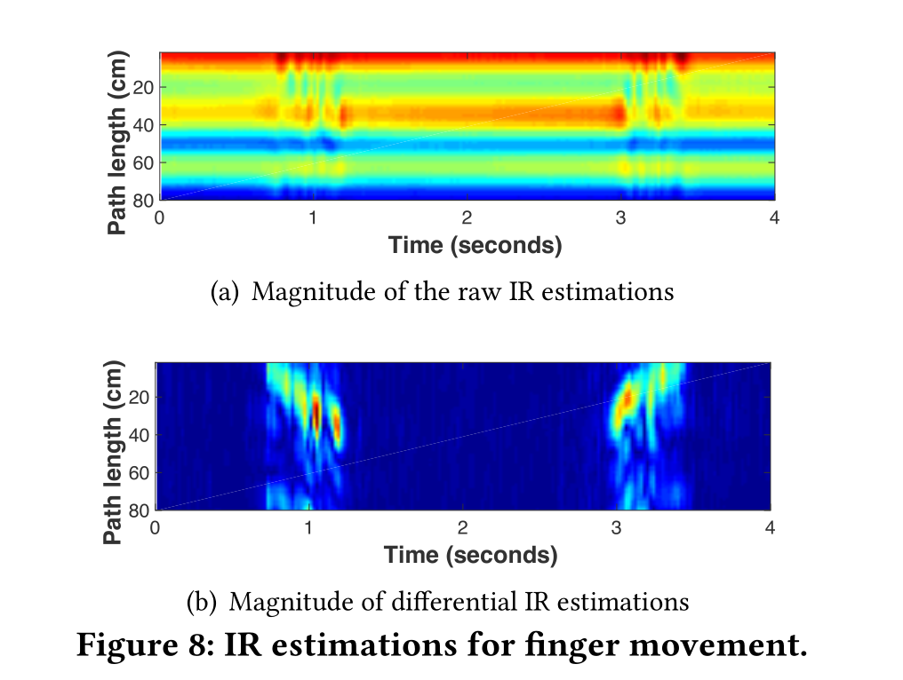

# ZC概览

ZC序列全称为`Zadoff-Chu`，使用zc序列作为发射信号，需要经过正弦载波调制。

为了减小编码序列的带宽，首先对原始ZC序列进行**插值**，有两种插值方法：

①时域方法：首先通过重复每个采样点k次（通常，k=6~8）来上采样序列，然后使用低通滤波器以确保信号占用所需的带宽。

②频域方法：首先对原序列做FFT，然后在频域对序列补零来增加序列的长度，最后使用IFFT将序列变换回时域。

由 u 参数化的原始 ZC 序列由下式给出：
$$
ZC[n]=e^{-j\frac{\pi un(n+1+2q)}{N_{zc}}}
$$
其中，$0\leq n\leq N_{ZC}$，q为常数，$N_{ZC}$为序列的长度，参数u是满足$0<u<N_{ZC}，gcd(N_{ZC,u})=1$的整数。

# ZC序列的调制和解调

使用**两步**将原始ZC序列转换成为用于声学运动追踪的人类听不见的声音信号：

**第一步：** 使用频域插值降低序列的带宽。首先对原始复ZC序列进行$N_{ZC}$点的FFT，通过对FFT结果的正频率分量之后和负频率分量之前插入零使得序列的长度满足$N_{ZC}^{'}=N_{ZC}f_s/B$，其中B是信号带宽，$f_s$为采样率；这样，插值后的ZC序列在频域中只占用很小的带宽B。最后，将插值后的信号做IFFT变换会时域。

**第二步：** 将信号上变换到通带。在上变换步骤中，插值后的ZC 序列与频率为fc的载频信号相乘，如上图所示。那么，传输的通带信号为：
$$
T(t)=cos(2\pi f_c t)ZC^I_T(t)-sin(2\pi f_ct)ZC_T^Q(t)
$$
其中，$ZC^I_T(t)$和$ZC_T^Q(t)$分别是时域ZC序列的实部和虚部。

**接收的ZC信号通过`下变换`回复数基带信号来解调，即上图步骤的逆向，但是只需要解调到插值后的zc序列就行。**

# 将ZC序列用于声学运动追踪

**以vskin论文为基础来介绍**

## 多路径传播模型

接收到的信号是不同延迟的发射信号的多个副本的叠加。

假设传输的基带信号为$ZC_T(t)$，并且系统为线性时不变（LTI）系统，那么收到的基带信号表示为：
$$
ZC_R(t)=\sum_{i=1}^LA_ie^{-j\phi_i}ZC_T(t-\tau_i)=h(t)*ZC_T(t)
$$
其中，L是传播路径的数量，$\tau_i$是第i条传播路径的延迟，$A_ie^{-j\phi_i}$是第i条传播路径的复路径系数。多径传播模型的冲激响应 (IR) 函数由下式给出：
$$
h(t)=\sum_{i=1}^LA_ie^{-j\phi_i}\delta(t-\tau_i)
$$
其中，$\delta(t)$是狄拉克冲击函数。

**因此，如果可以求得信号的冲激响应 h(t)，我们就可以知道不同路径延时的幅度，从而来分离不同延时的路径。**

通过将收到的基带信号$ZC_R(t)$与传输的ZC序列互相关求得冲激响应的估计：$\hat h(t)=ZC_R(t)*ZC_T^*(-t)$，论文中是$\hat h(t)=ZC_R^*(-t)*ZC_T(t)$。

由于ZC序列良好的循环自相关特性，ZC序列自相关只在 t = 0 是不为 0 的， 其他点均为 0，即自相关结果为 $\delta(t)$，因此$\hat h(t)$提供了冲激函数的良好的近似。证明如下：

根据相关计算等价于卷积逆序序列的共轭，假设$ZC_t(t)$的自相关为$\delta(t)$，即：$$ZC_T(t)*ZC^*_T(-t)=\delta(t)$$

因此，根据卷积操作满足交换律和结合律，以及任意函数与 $\delta(t)$ 卷积仍然维持不变，得：
$$
\begin{aligned}
ZC_R(t)*ZC_T^*(-t) &= h(t)*ZC_T(t)*ZC_T^*(-t)\\
&= h(t)*\delta(t)\\
&=h(t)
\end{aligned}
$$
每个IR估计的峰值表明了在相应延迟处的一条传播路径。

## 声音传播模型

在`vskin`中，有三条不同的声音传播路径，分别是：结构声传播路径、直接空气传播路径、反射空气传播路径，如下图所示：

下表列出了上图中扬声器和两个麦克风之间六种不同路径的理论传播延迟和幅度：

## 声音路径分离

两个麦克风的冲激响应估计如下图所示：

**使用两个麦克风的 IR 估计来识别不同的传播路径，对应的路径如上图**

## 路径系数测量

**对于路径 i，其延时在冲击响应中为 $n_i$，那么我们想要得到的路径系数就是 $h[n_i ]$ 的复数值。**这个复数值体现了在特定的延时下声音的相位和幅度的变化。**`多路径传播模型`中提到的最基础的利用互相关求路径系数的方法由于采样率低（对于⼀帧信号只能得到对应特定延时的⼀个结果）且计算量大而不适用。**

对于给定延时为n的采样点，t 时刻的冲击响应估计为：
$$
\hat h_t[n]=\sum_{l=0}^{N_{zc}'-1}ZC_R[t+l]\times ZC^*_T[(l-n)modN_{zc}']
$$
因此，我们通过对$ZC_R^*(-t)$和$ZC_T(t)$做循环卷积得到路径系数。**对于两个向量 `x` 和 `y`，循环卷积等于二者的离散傅里叶变换 (DFT) 之积的逆 DFT 变换，[matlab中求循环卷积](https://ww2.mathworks.cn/help/signal/ug/linear-and-circular-convolution.html)。**

## 手指移动测量

### 手指移动模型

使用路径系数中的相位来测量移动距离已达到毫米级别的测量精度。

对于第i条路径，其路径系数为：
$$
\hat h_t[n_i]=A_ie^{-j(\phi_i+2\pi\frac{d_i(t)}{\lambda_c})}
$$
其中，$d_i(t)$是在时刻t时的路径距离。

因此对于路径i的相位为$\phi_i(t)=\phi_i+2\pi \frac{d_i(t)}{\lambda_c}$。当距离$d_i(t)$改变一个波长$\lambda_c=c/f_c$时，相位改变$2\pi$。

### 估计反射路径延时

由于自相关函数的主瓣宽度不可忽略，靠近反射路径的多个IR估计在手指移动时具有相似的变化。

确定反射路径延迟的启发式方法是基于**反射路径与其他路径相比将具有最大的幅度变化**。

考虑冲激响应随时间轴的差分：
$$
|\hat h_t[n_i]-\hat h_{t-\Delta t}[n_i]|=|A_i(e^{-j(\phi_i+2\pi\frac{d_i(t)}{\lambda_c})}-e^{-j(\phi_i+2\pi\frac{d_i(t-\Delta t)}{\lambda_c})})|
$$
假设$A_i$在短时间$\Delta t$内几乎不变，当延时$n_i$与反射路径相同时，$|\hat h_t[n_i]-\hat h_{t-\Delta t}[n_i]|$最大。

在具体实现中，我们选择彼此间隔3个样本的L个路径系数作为反射路径的候选。我们不断监测候选路径系数，动态地选择差分IR估计中幅度最大的路径作为反射路径。当手指静止时，我们的系统仍然会跟踪反射路径。 这样，我们就可以利用所选反射路径的变化来检测手指是否移动。

**注意如何选择延时的范围还和想要实现的应用有关**， 并且决定了想要实现的应用的作用范围。举例来说，如果是想要实现背面手机的控制，那么手指的移动范围在 5 ∼ 20 cm 之间，因此只需要在 5 ∼ 15 个采样点之间来选择延时就可以。如果是想要实现远距离的隔空手势 (< 50 cm)，那么手指的移动范围更大，因此需要在更多的采样点之间进行延时选择。

### 基于相位的移动测量

确定好发射路径的路径延时后，进而求出相应的路径系数，然后仿照LLAP中的方法即可求出对应的相位

由于$$\phi_i(t)=\phi_i+2\pi \frac{d_i(t)}{\lambda_c}$$，因此$\Delta d=\frac{(\phi_i(t)-\phi_i(0))*\lambda_c}{2\pi}$即可求出$0{\backsim} t$时间内手指距离的变化

